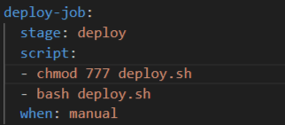

### Part 1. Настройка **gitlab-runner**

##### Подними виртуальную машину *Ubuntu Server 22.04 LTS*.

##### Скачай и установи на виртуальную машину **gitlab-runner**.

- Устанавливаем gitlab-runner

##### Запусти **gitlab-runner** и зарегистрируй его для использования в текущем проекте (*DO6_CICD*).
- Запускаем и регистрируем gitlab-runner по токену и URL с платформы к этому заданию

### Part 2. Сборка

#### Напиши этап для **CI** по сборке приложений из проекта *C2_SimpleBashUtils*.

##### В файле _gitlab-ci.yml_ добавь этап запуска сборки через мейк файл из проекта _C2_.

- Копируем папки из проекта C2_SimpleBashUtils, в _.gitlab-ci.yml_ указываем путь до makefile:

- В ``stages:`` уже есть ``build``

### Part 3. Тест кодстайла

#### Напиши этап для **CI**, который запускает скрипт кодстайла (*clang-format*).

- В ``stages:`` добаволяем ``-style``
 

- Если кодстайл прошел

 

##### Если кодстайл не прошел, то «зафейли» пайплайн.

 

##### В пайплайне отобрази вывод утилиты *clang-format*.

### Part 4. Интеграционные тесты

#### Напиши этап для **CI**, который запускает твои интеграционные тесты из того же проекта.

- В ``stages:`` добаволяем ``-test``

 

##### Запусти этот этап автоматически только при условии, если сборка и тест кодстайла прошли успешно.

 - Последующие стадии автоматически пропускается, если предыдущие зафейлены

##### Если тесты не прошли, то «зафейли» пайплайн.

 

##### В пайплайне отобрази вывод, что интеграционные тесты успешно прошли / провалились.

 
 

### Part 5. Этап деплоя

##### Подними вторую виртуальную машину *Ubuntu Server 22.04 LTS*.

 

#### Напиши этап для **CD**, который «разворачивает» проект на другой виртуальной машине.

- Устанавливаем сетевые адаптеры "сетевой мост"

- C помощью команды ``sudo su gitlab-ranner``  переключаемся на пользователя gitlab-ranner. Генерируем ssh ключю
- При помощи команды ``ssh-copy-id <имя_пользователя>@<публичный_IP-адрес_ВМ>`` устанавливаем соединение со 2й машиной
- Для пользователя 2й ВМ выполняем команду ``chown <имя_пользователя> /usr/local/bin``, чтобы пользователь стал владельцом директории и не возникало ошибок с доступом при копировании файлов

##### Запусти этот этап вручную при условии, что все предыдущие этапы прошли успешно.

##### Напиши bash-скрипт, который при помощи **ssh** и **scp** копирует файлы, полученные после сборки (артефакты), в директорию */usr/local/bin* второй виртуальной машины.

 

##### В файле _gitlab-ci.yml_ добавь этап запуска написанного скрипта.

 

##### В случае ошибки «зафейли» пайплайн.

 

В результате ты должен получить готовые к работе приложения из проекта *C2_SimpleBashUtils* (s21_cat и s21_grep) на второй виртуальной машине.

 
 
 

### Part 6. Дополнительно. Уведомления

##### Настрой уведомления о успешном/неуспешном выполнении пайплайна через бота с именем «[твой nickname] DO6 CI/CD» в *Telegram*.

- Создаем бота в Телеграм с помощью BotFather:

- Далее создадим скрипт telega.sh:
 

- Добавляем в ``stages:`` добаволяем ``telega``
 

- Проверяем 
 